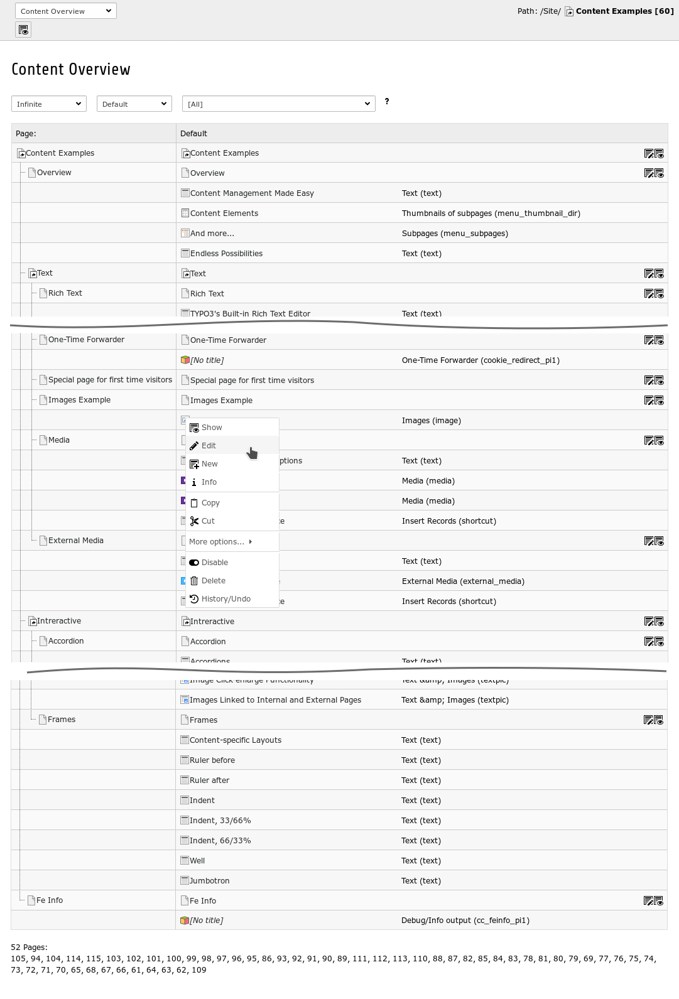

.. ==================================================
.. FOR YOUR INFORMATION
.. --------------------------------------------------
.. -*- coding: utf-8 -*- with BOM.

.. include:: ../Includes.txt

Introduction
============

What does it do?
----------------

This extension provides a backend module which gives an overview of the the content elements in a page tree.

You can find the module under *Web > Info > Content Overview*. There are some filters available and the possibility to
click on the elements for editing and more information.

Screenshots
-----------

The module looks like this:

    Content Overview module

