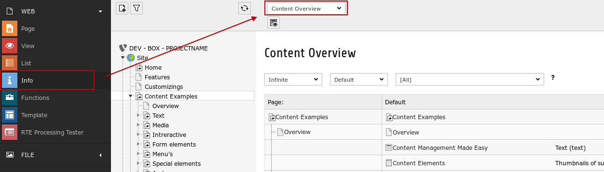
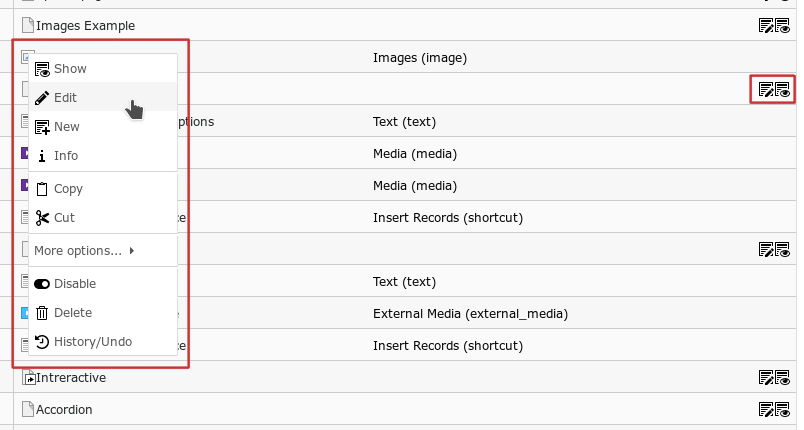

.. include:: ../Includes.txt

Users Manual
============

The module can be found in *Web > Info > Content Overview*.

    Web > Info > Content Overview

With a click on a page in the page tree you define the starting point for the overview.

With the filter select boxes in the top area you define:

- page tree depth
- languages
- content elements

You can find action icons for pages and clicking on a content element shows a typical context menu appears.

    context menu and action icons
